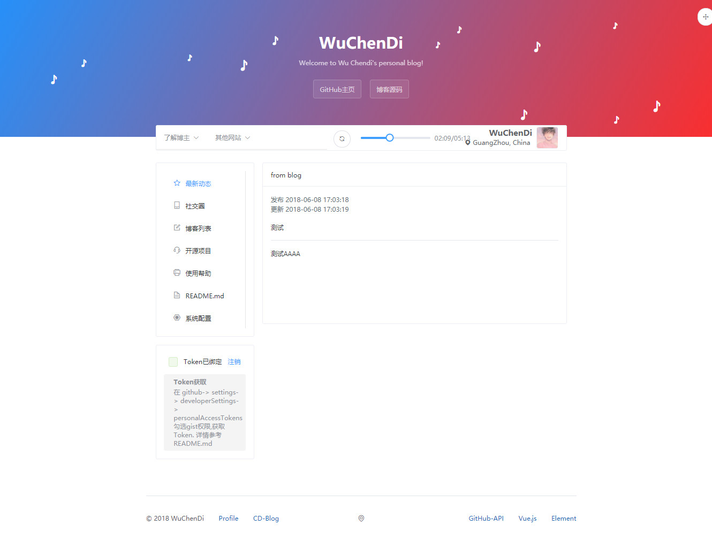
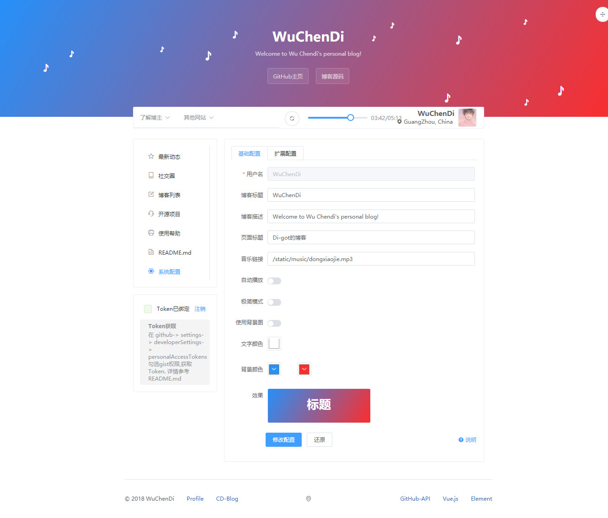
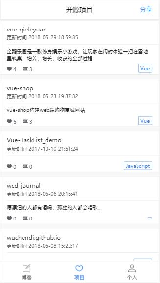

# CD-Blog


## [中文文档](README.md)

## Demo

[https://WuChenDi.github.io][1]


## Plugin

- Element (PC)
- Vant (Mobile)

## Example Pictures






## Use Setup

Clone ```https://github.com/WuChenDi/WuChenDi.github.io ```


## Develop

#### Install Run Build

    npm install

    npm run dev

    npm run build


## License

Code licensed under the [Mozilla](LICENSE).

------


Author *WuChenDi*


  [1]: https://WuChenDi.github.io
  [2]: https://github.com/WuChenDi/CD-Blog
