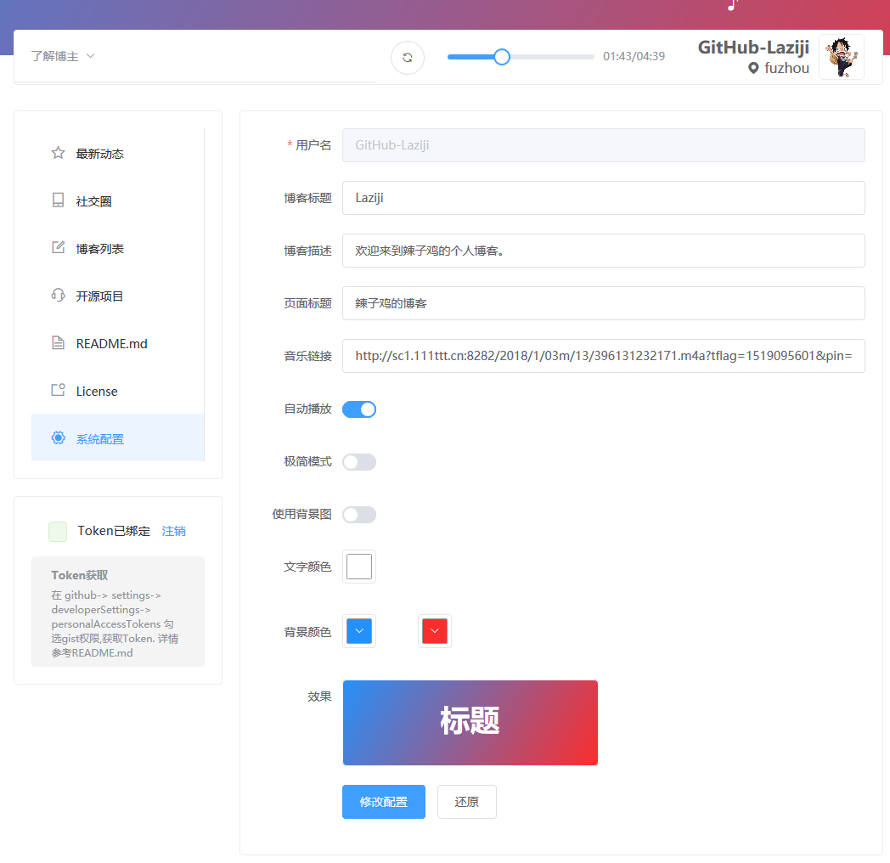

# WuChenDi-Blog

  


## [English Documents](README-EN.md)

## 目录
- [简介](#简介)
- [演示地址](#演示地址)
- [项目特点](#项目特点)
- [使用的组件](#使用的组件)
- [项目截图](#项目截图)
- [快速使用](#快速使用)
- [开发](#开发)
- [更新记录](#更新记录)
- [License](#License)

## 简介

博客基于 GitHub Pages 与 Github API 实现无后台，可动态发布博客的系统
博客数据储存于gist 通过Github API 进行增删改查
喜欢的话留下你的星星╭(●｀∀´●)╯╰(●’◡’●)╮

## 演示地址
[https://WuChenDi.github.io][1]

## 项目特点

- [x] 基于 GitHub Pages 无需服务器
- [x] 改进传统 GitHub Pages 不能动态发布的缺陷
- [x] 包含电脑端和移动端
- [x] 单页面应用

## 使用的组件

- Element (电脑端)
- Vant (移动端)

## 项目截图





## 快速使用
搭建博客只需2步
- 点击github头像旁边的 "+" 号 选择 ```Import repository ```克隆地址填 ```https://github.com/WuChenDi/WuChenDi.github.io ```项目名填 ```你的用户名.github.io ```
- 克隆完成后 修改文件 ```/static/configuration.json``` 中的 ```githubUsername``` 为自己的github用户名


类似演示地址其中 WuChenDi 为我的用户名


现在 ```https://你的用户名.github.io``` 就是你的个人博客了,例如[https://WuChenDi.github.io][1]

## 开发

#### 安装 运行 构建

    npm install

    npm run dev

    npm run build

#### 获取Token

在 ```github > settings > Developer settings > Personal access tokens```  勾选```gist``` 和 ```repo```权限 获取```Token```

#### 开发注意事项

- 配置文件读取的总是与 ```index.html``` 同级的 ```./static/configuration.json```, 所以本地 ```npm run dev``` 的时候会出现修改配置无效的情况, 如果需要修改的话修改本地的配置文件就行, 发布到 github 之后不影响, 因为修改配置的时候是通过 ```github-api``` 修改 ```你的用户名.github.io``` 下的 ```/static/configuration.json ```

## 更新记录

#### 2018.6-8 更新
- 推出个人博客Blog

## License
Code licensed under the [Mozilla](LICENSE).

------

作者 *WuChenDi*

  [1]: https://WuChenDi.github.io
  [2]: https://github.com/WuChenDi/CD-Blog
